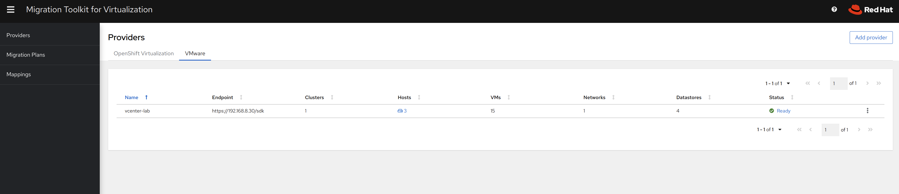
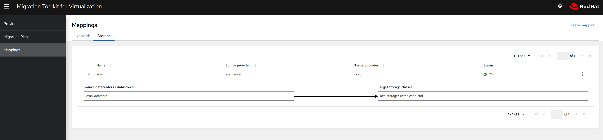
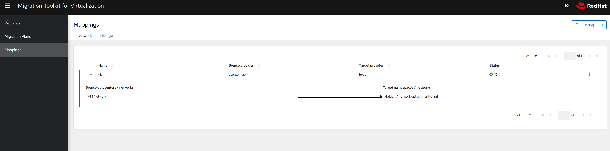
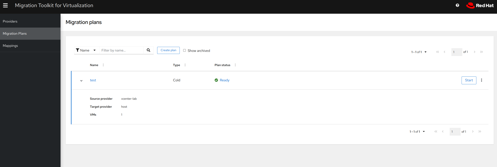
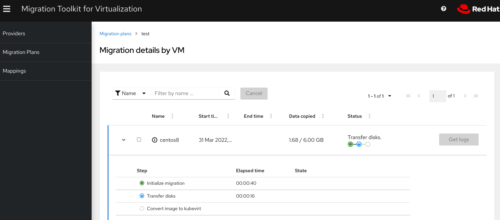
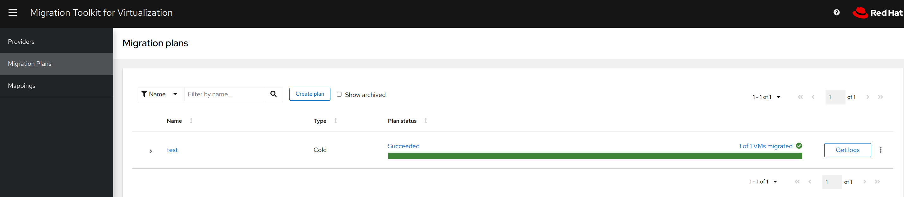

# Migrating  VMs from vSphere to OpenShift CNV with Migration Toolkit for Virtualization (MTV)

## Introduction

This post will walk you through  VM migration  from vSphere to Openshift Virtualisation (Kubevirt) by using  Migration Toolkit for Virtualization (MTV). It gatherered everything I could find on the subject during an engagment for a customer of mine.

MTV is **Red Hat**'s supported version of upstream project **Forklift** and migrates virtualized workloads from different sources to Kubernetes using KubeVirt. It is designed to make the task simple so that you can migrate anything from one or two machines to hundreds of them.
Migration is a simple, three-stage process:

- Connect to an existing virtualization platform (known as a "source provider") and to a Kubernetes environment (a "target provider").
  
- Map network and storage resources from the source provider to the target provider, looking for equivalent resources in both.

- Select virtual machines to migrate and assign the network and storage mappings to formulate a migration plan. Then run it.

## Prerequisites

- OCP 4.9+
- An internal OpenShift image registry or a secure external registry
- vSphere API accesible form the OCP cluster
  
## Part I

## CNV (Kubevirt) installation and configuration

In this part we are going to setup OCP so Kubevirt VMs can be plugged into multiple Networks.

- Install the CNV (Kubevirt) Operator

  ```bash
  cat << EOF | oc create -f -
  apiVersion: v1
  kind: Namespace
  metadata:
    name: openshift-cnv
  ---
  apiVersion: operators.coreos.com/v1
  kind: OperatorGroup
  metadata:
    name: kubevirt-hyperconverged-group
    namespace: openshift-cnv
  spec:
    targetNamespaces:
      - openshift-cnv
  ---
  apiVersion: operators.coreos.com/v1alpha1
  kind: Subscription
  metadata:
    name: hco-operatorhub
    namespace: openshift-cnv
  spec:
    source: redhat-operators
    sourceNamespace: openshift-marketplace
    name: kubevirt-hyperconverged
    startingCSV: kubevirt-hyperconverged-operator.v4.9.3
    channel: "stable"
  EOF

  ```

- Check installation

  ```bash
  [root@registry ~] oc get csv -n openshift-cnv
  NAME                                      DISPLAY                    VERSION   REPLACES                                  PHASE
  kubevirt-hyperconverged-operator.v4.9.3   OpenShift Virtualization   4.9.3     kubevirt-hyperconverged-operator.v4.9.2   Succeeded
  ```

- Create hyperconverged object to instantiate the operator

  ```bash

  cat << EOF | oc create -f -
  apiVersion: hco.kubevirt.io/v1beta1
  kind: HyperConverged
  metadata:
    name: kubevirt-hyperconverged
    namespace: openshift-cnv
  EOF

  ```

- Setup bridge interface on Worker Nodes

  In this scenario, Kubevirt VMs will be attached to multiple Vlans. This is achieved by creating a linux bridge and a Network attachment.

  A Network attachment definition is a custom resource that exposes layer-2 devices to a specific namespace in your OpenShift Virtualization cluster.

  ```bash  

  cat << EOF | oc create -f -
  apiVersion: nmstate.io/v1beta1
  kind: NodeNetworkConfigurationPolicy
  metadata:
    name: br1-ens224-policy-workers
  spec:
    nodeSelector:
      node-role.kubernetes.io/worker: ""
    desiredState:
      interfaces:
        - name: linux-br1
          description: Linux bridge with ens224 as a port
          type: linux-bridge
          state: up
          ipv4:
            enabled: false
          bridge:
            options:
              stp:
                enabled: false
            port:
              - name: ens224
  EOF
  ```

- Setup Network Attachment using previously created bridge
  
  ```bash
    cat << EOF | oc apply -f -
    apiVersion: "k8s.cni.cncf.io/v1"
    kind: NetworkAttachmentDefinition
    metadata:
      name: network-attachment-vlan1
      annotations:
        k8s.v1.cni.cncf.io/resourceName: bridge.network.kubevirt.io/linux-br1
    spec:
      config: '{
        "cniVersion": "0.3.1",
        "name": "network-attachment-vlan1",
        "plugins": [
          {
            "type": "cnv-bridge",
            "bridge": "linux-br1"
          },
          {
            "type": "tuning"
          }
        ]
      }'
    EOF
  ```

- Set a trunk bridge on workers

  In the same manner a trunk bridge can be configured so we can then create multiple vlan network attachment to connect VMs or/and Pods

  ```bash
  cat << EOF | oc create -f -
  apiVersion: nmstate.io/v1beta1
  kind: NodeNetworkConfigurationPolicy
  metadata:
    name: br0-ens2f0np0-policy-workers
  spec:
    nodeSelector:
      node-role.kubernetes.io/worker: ""
    desiredState:
      interfaces:
        - name: linux-br0
          description: Linux bridge with ens2f0np0 as a port
          type: linux-bridge
          state: up
          ipv4:
            enabled: false
          ipv6:
            enabled: false
          bridge:
            options:
              stp:
                enabled: false
            port:
            - name: ens2f0np0
              vlan:
                enable-native: false
                mode: trunk
  EOF
  ```

- Vlan Network attachment
  
  In this example we create a network attachment so VMs can connect to Vlan 113

  ```bash
  cat << EOF | oc create -f -
  apiVersion: "k8s.cni.cncf.io/v1"
  kind: NetworkAttachmentDefinition
  metadata:
    name: net-vlan113
    annotations:
      k8s.v1.cni.cncf.io/resourceName: bridge.network.kubevirt.io/linux-br0
  spec:
    config: '{
      "cniVersion": "0.3.1",
      "name": "net-vlan113", 
      "type": "cnv-bridge", 
      "bridge": "linux-br0",
      "vlan": 113 
    }'
  EOF
  ```

## Part II

## **MTV (Forklift) installation and configuration**

- Install the MTV Operator

  ```bash
  cat << EOF | oc apply -f -
  apiVersion: project.openshift.io/v1
  kind: Project
  metadata:
    name: openshift-mtv

  ----
  apiVersion: operators.coreos.com/v1
  kind: OperatorGroup
  metadata:
    name: migration
    namespace: openshift-mtv
  spec:
    targetNamespaces:
      - openshift-mtv

  ---
  apiVersion: operators.coreos.com/v1alpha1
  kind: Subscription
  metadata:
    name: mtv-operator
    namespace: openshift-mtv
  spec:
    channel: release-v2.2.0
    installPlanApproval: Automatic
    name: mtv-operator
    source: redhat-operators
    sourceNamespace: openshift-marketplace
    startingCSV: "mtv-operator.2.2.0"
  ```

- Check Operator is ready

  ```bash
  [root@registry AI-vSphere]oc get csv -n openshift-mtv
  NAME                  DISPLAY                                         VERSION   REPLACES   PHASE
  mtv-operator.v2.2.0   Migration Toolkit for Virtualization Operator   2.2.0                Succeeded
  ```

- Instantiate by creating ForkliftController CR

  ```bash
  cat << EOF | oc apply -f -
  apiVersion: forklift.konveyor.io/v1beta1
  kind: ForkliftController
  metadata:
    name: forklift-controller
    namespace: openshift-mtv
  spec:
    olm_managed: true
  EOF
  ```

- Download  [VMware VDDK](https://code.vmware.com/sdk/vddk)

  This is required to copy VMDK disks to Kubevirt

- Extract the VDDK archive and cd into the extracted folder

  ```bash
  cat > Dockerfile <<EOF
  FROM registry.access.redhat.com/ubi8/ubi-minimal
  COPY vmware-vix-disklib-distrib /vmware-vix-disklib-distrib
  RUN mkdir -p /opt
  ENTRYPOINT ["cp", "-r", "/vmware-vix-disklib-distrib", "/opt"]
  EOF

- Build vddk image and push it to local registry

  **⚠**  Change registry's FQDN to match your environment

  ```bash

  podman build . -t default-route-openshift-image-registry.apps.ocpd.lab.local/default/vddk:latest
  podman push default-route-openshift-image-registry.apps.ocpd.lab.local/default/vddk:latest  --tls-verify=false

  ```

- Edit hyperconverged CR and add vddkInitImage

  ```yaml
  apiVersion: hco.kubevirt.io/v1beta1
  kind: HyperConverged
  metadata:
    name: kubevirt-hyperconverged
    namespace: openshift-cnv
  spec:
    vddkInitImage: default-route-openshift-image-registry.apps.ocpd.lab.local/default/vddk:latest 
  ```

- Create the  provider

   We must base64 encode vSphere user, password and thumbprint and create a secret that is going to be used in the **provider** CR

    **⚠**   **Change values to match your environment**

    ```bash
    PASSWD=$(echo 'vSpherepassword'|tr -d "\n" |base64 -w0)

    USER=$(echo 'vSphereadminuser'|tr -d "\n"|base64 -w0)

    THUMBPRINT=$(openssl s_client -connect 192.168.8.30:443 < /dev/null 2>/dev/null \ | openssl x509 -fingerprint -noout -in /dev/stdin \ | cut -d '=' -f 2|tr -d "\n"|base64 -w0)
    VCENTERURL='https://192.168.8.30/sdk' 
    ```

  Then we create the secret

    ```bash
    cat << EOF | oc create -f -
    apiVersion: v1
    data:
      password: $PASSWD
      thumbprint: $THUMBPRINT
      user: $USER
    kind: Secret
    metadata:
      name: vcenter-lab
      namespace: openshift-mtv
    type: Opaque
    EOF

    ```

  and the **vSphere provider**

  ```bash
    cat << EOF | oc create -f -
    apiVersion: forklift.konveyor.io/v1beta1
    kind: Provider
    metadata:
      name: vcenter-lab
      namespace: openshift-mtv
    spec:
      secret:
        name: vcenter-lab
        namespace: openshift-mtv
      type: vSphere
      url: $VCENTERURL
    EOF

  ```

- Check results with CLI or GUI

  ```bash
  [root@registry ~] oc get provider
  NAME          TYPE        READY   CONNECTED   INVENTORY   URL                        AGE
  host          openshift   True    True        True                                   2d20h
  vcenter-lab   vSphere     True    True        True        https://192.168.8.30/sdk   3m14s
  ```
  
  A route for MTV GUI is created in the **openshift-mtv** Namespace

    ```bash
  [root@registry AI-vSphere]# oc get route
  NAME                 HOST/PORT                                              PATH   SERVICES             PORT    TERMINATION          WILDCARD
  forklift-inventory   forklift-inventory-openshift-mtv.apps.ocpd.lab.local          forklift-inventory   <all>   reencrypt/Redirect   None
  virt                 virt-openshift-mtv.apps.ocpd.lab.local                        forklift-ui          <all>   reencrypt/Redirect   None
  ```

  We can now access the GUI
  
  **⚠**  The route will be different in your environment

  <https://virt-openshift-mtv.apps.ocpd.lab.local/providers/vSphere>
  
  

- Create Mapping

  We need to map network and storage resources from the source provider to the target provider, looking for equivalent resources in both

  - Create Storage mapping

    ```bash

    cat << EOF | oc create -f -
    apiVersion: forklift.konveyor.io/v1beta1
    kind: StorageMap
    metadata:
      name: vsan
      namespace: openshift-mtv
    spec:
      map:

    - destination:
          accessMode: ReadWriteMany
          storageClass: ocs-storagecluster-ceph-rbd
        source:
          name: vsanDatastore
      provider:
        destination:
          name: host
          namespace: openshift-mtv
        source:
          name: vcenter-lab
          namespace: openshift-mtv
    EOF
    ```

  - Create a Network mapping

  **⚠**  The destination namespace must be the same as the network attachment created previously

    ```bash
    cat << EOF | oc create -f -
    apiVersion: forklift.konveyor.io/v1beta1
    kind: NetworkMap
    metadata:
      name: vlan1
      namespace: openshift-mtv
    spec:
      map:
      - destination:
          name: vlan1  
          namespace: default
          type: multus
        source:
          name: VM Network
      provider:
        destination:
          name: host
          namespace: openshift-mtv
        source:
          name: vcenter-lab
          namespace: openshift-mtv
    EOF

  - Observe the results in the GUI

    

    

    or use the CLI:

    ```bash
    [root@registry ~] oc describe storagemaps.forklift.konveyor.io vsan 
    Name:         vsan
    Namespace:    openshift-mtv
    Labels:       <none>
    Annotations:  forklift.konveyor.io/shared: true
    API Version:  forklift.konveyor.io/v1beta1
    Kind:         StorageMap
    Metadata:
      UID:               d2174ae9-2b3c-402c-be94-fa83a4a0c814
      .....

    ```

    ```bash
    Spec:
      Map:
        Destination:
          Storage Class:  ocs-storagecluster-ceph-rbd
        Source:
          Id:  datastore-1048
    ```

    We can see that the datastore **Name** has been replaced by its **Id**. The same thing can be observed with Network Mapping

    ```bash
    Spec:
      Map:
        Destination:
          Name:       vlan1
          Namespace:  default
          Type:       multus
        Source:
          Id:  network-1051
      Provider:
        Destination:
          Name:       host
          Namespace:  openshift-mtv
        Source:
          Name:       vcenter-lab
          Namespace:  openshift-mtv
    Status:
      Conditions:
        Category:              Required
        Last Transition Time:  2022-03-23T21:55:04Z
        Message:               The network map is ready.
    ```

## **Part III**

## Create an MTV/Forklift Plan

 A migration plan describe how one or more VMs will be migrated. It specifies what mapping and providers are to be used and what VMs are to be migrated. It leverages on the objects we previously created

- A simple plan
  
  Prepare and observe the **migration plan** CR structure.

  - The map block specifies what mapping to use for storage and network. We use the name of the mapping created previously

    ```yaml

    apiVersion: forklift.konveyor.io/v1beta1
    kind: Plan                             
    metadata:
      name: test
      namespace: openshift-mtv
    spec:
      archived: false
      description: ""
      map:
        network:
          name: vlan1  ##### Name of the network mapping we previously created ###
          namespace: openshift-mtv
        storage:
          name: vsan 
          namespace: openshift-mtv
    ```

  - The Provider block indicates the source provider of our VM **vcenter-lab** and its destination **host** as well as the namespace where you want your Kubevirt VM to run. That is **vcenter-lab**, **host** and  **default** in this case

    ```yaml
      provider:
        destination:
          name: host   
          namespace: openshift-mtv
        source:
          name: vcenter-lab    #####your source provider goes here ###
          namespace: openshift-mtv
      targetNamespace: default   ####The namespace you want your VM to run in ####
    ```

  - The **vms** block allows us to specify what vm to migrate

    ```yaml
      vms:
      - hooks: []
        name: centos8    ####Name of the vm to be migrated. Lowercases names only  !!!
      warm: false #### The VM will be stopped before migration
    EOF
    ```

- Create the plan

   ```bash
  cat << EOF | oc create -f -
  apiVersion: forklift.konveyor.io/v1beta1
  kind: Plan
  metadata:
    name: test
    namespace: openshift-mtv
  spec:
    archived: false
    description: ""
    map:
      network:
        name: vlan1
        namespace: openshift-mtv
      storage:
        name: vsan
        namespace: openshift-mtv
    provider:
      destination:
        name: host
        namespace: openshift-mtv
      source:
        name: vcenter-lab
        namespace: openshift-mtv
    targetNamespace: default
    vms:
    - hooks: []
      name: centos8
    warm: false
  EOF
  ```

- Check the plan status with the CLI and the GUI
  
  ```bash
  root@registry AI-vSphere]# oc get plan
  NAME   READY   EXECUTING   SUCCEEDED   FAILED   AGE
  test   True                                     9s
  ```

  
- Run the Plan
  
  To run the plan, a **migration** CR is needed

  ```bash
  cat << EOF | oc apply -f -
  apiVersion: forklift.konveyor.io/v1beta1
  kind: Migration
  metadata:
    name: migration-test
    namespace: openshift-mtv
  spec:
    plan:
      name: test
      namespace: openshift-mtv
  EOF

  ```

- Observe the migration happening
  

  Plan is starting

  ```bash
  [root@registry AI-vSphere]oc get plan
  NAME   READY   EXECUTING   SUCCEEDED   FAILED   AGE
  test   True    True                             13m
  ```

  A PVC is created in the  namespace we chose and the migrating VM disk is being copied to it

  ```bash
  root@registry AI-vSphere]oc get pvc -n default
  NAME                 STATUS   VOLUME                                     CAPACITY   ACCESS MODES   STORAGECLASS                  AGE
  test-vm-5058-6glbc   Bound    pvc-f0042e2f-e8ea-48e0-a8d3-dbd9c3159290   6Gi        RWO            ocs-storagecluster-ceph-rbd   105s
  ```

  The VM has now been created

  ```bash
  [root@registry AI-vSphere]oc get vm -n default
  NAME      AGE     STATUS    READY
  centos8   3m51s   Stopped   False
  ```

  Migration has completed

  ```bash
  [root@registry AI-vSphere]# oc get plan
  NAME   READY   EXECUTING   SUCCEEDED   FAILED   AGE
  test   True                True                 16m
  ```

  

- Check the new VM

  The newly created VM is connected to the desired network and is 1to1 copy of the original
  
  ```bash
  [root@registry AI-vSphere]oc describe vm centos8 -n default
  Name:         centos8
  Namespace:    default

  .....................Truncated.................
  Spec:
    Running:  true
    Template:
      Metadata:
        Creation Timestamp:  <nil>
      Spec:
        Domain:
          Clock:
            Timer:
            Timezone:  UTC
          Cpu:
            Cores:    1
            Sockets:  1
          Devices:
            Disks:
              Disk:
                Bus:  virtio
              Name:   vol-0
            Inputs:
              Bus:   virtio
              Name:  tablet
              Type:  tablet
            Interfaces:
              Bridge:
              Mac Address:  00:50:56:9c:45:bb 
              Model:        virtio
              Name:         net-0
          Features:
            Acpi:
          Firmware:
            Bootloader:
              Bios:
            Serial:  421c483c-c989-2d26-e036-c36e59faba52
          Machine:
            Type:  q35
          Resources:
            Requests:
              Memory:  1Gi
        Networks:
          Multus:
            Network Name:  default/vlan1  
          Name:            net-0
        Volumes:
          Data Volume:
            Name:  test-vm-5058-6glbc
          Name:    vol-0 
  ```
  
## **Part IV**

## **Running pre/post migration Ansible hook**

## A Simple Hook

  It is possible to run an Ansible  playbook against the VM before or after migration. This is made possible by running the playbook inside  an [ansible-runner](<https://ansible-runner.readthedocs.io/en/stable/>) pod that is created during the process.
  The hook is added to a migration plan by using the MTV web console or by specifying values for the spec.hooks parameters in the Migration Plan custom resource (CR) manifest.
  The hook container runs as a job, using the cluster, service account, and namespace specified in the Migration Plan CR. The hook container uses a specified service account token so that the tasks do not require authentication before they run in the cluster.
  When a hook is called during the migration, it starts with some information mounted as a ConfigMap in **/tmp/hook/**. The most valuable informations are in the /tmp/hook/workloads.yaml** and can be visualized by running a simple playbook:

```yaml
---
- hosts: localhost
  connection: local
  tasks:
    - name: "Print all"
      setup:
    - name: Dump
      debug:
        var: hostvars[inventory_hostname]
```

This will dump all available variables for us to use when applying mor complex playbooks

- Create the hook CR

  The playbook must be base64 encoded and added to the CR
  
  ```bash

  PLAYBOOKBASE64=$(cat playbook/simple-playbook.yaml|base64 -w0)

  cat << EOF | oc create -f -
  apiVersion: forklift.konveyor.io/v1beta1
  kind: Hook
  metadata:
    name: playbook
    namespace: openshift-mtv
  spec:
    image: quay.io/konveyor/hook-runner:nmcli 
    playbook: |
      $PLAYBOOKBASE64
    serviceAccount: forklift-controller
  EOF
  ```

- Prepare the **migration plan** CR .

  - We must add the **hook** to the **vms** block

    ```yaml
      vms:
      - hooks:
        - hook:
            name: simplehook  ####The name of the hook we previously created###
            namespace: openshift-mtv
          step: PreHook  ###Specifies we want to apply the hook before migration
        name: centos8    ####Name of the vm to be migrated. Lowercases names only  !!!
      warm: false
    EOF
    ```

- Let's create the plan with the following command:

  ```bash
  cat << EOF | oc create -f -
  apiVersion: forklift.konveyor.io/v1beta1
  kind: Plan
  metadata:
    name: test
    namespace: openshift-mtv
  spec:
    archived: false
    description: ""
    map:
      network:
        name: vlan1
        namespace: openshift-mtv
      storage:
        name: vsan
        namespace: openshift-mtv
    provider:
      destination:
        name: host
        namespace: openshift-mtv
      source:
        name: vcenter-lab
        namespace: openshift-mtv
    targetNamespace: default
    vms:
    - hooks:
      - hook:
          name: simplehook
          namespace: openshift-mtv
        step: PreHook
      name: centos8
    warm: false
  EOF
  ```

- Run the Plan
  
- Observe
  
  When the plan is ran, a prehook pod named **your plan name-your vm Id-prehook/posthook-random characters** is created. This is where the ansible playbook will run

  ```bash
  [root@registry AI-Vsphere] oc get pod
  NAME                                        READY   STATUS      RESTARTS      AGE
  forklift-controller-5cdb8d6cb8-fkxlr        2/2     Running     0             24h
  forklift-must-gather-api-78c59f4b65-wg2p2   1/1     Running     0             24h
  forklift-operator-7d458846d7-8n4g9          1/1     Running     2 (24h ago)   24h
  forklift-ui-549bcf4b64-s9wz2                1/1     Running     0             24h
  forklift-validation-75f48fbddd-h5tm5        1/1     Running     0             24h
  test-vm-5058-prehook-bqhv9-nc6zs            0/1     Running   0             8s ## ansible-runner pod has just been created
  ```

- Watch the pod logs
  
  The playbook has completed successfully and we can see some of the ansible variables that were retrieved.
  (The full version of the logs can be found in examples folder)

  ```bash
  [root@registry AI-Vsphere]oc logs test-vm-5058-prehook-bqhv9-nc6zs

  [WARNING]: No inventory was parsed, only implicit localhost is available
  [WARNING]: provided hosts list is empty, only localhost is available. Note that
  the implicit localhost does not match 'all'

  PLAY [localhost] ***************************************************************

  TASK [Gathering Facts] *********************************************************
  ok: [localhost]

  TASK [Print all] ***************************************************************
  ok: [localhost]

  TASK [Dump] ********************************************************************
  o": "2022-03-24T17:59:43.768471Z",
              "minute": "59",
              "month": "03",
              "second": "43",
              "time": "17:59:43",
              "tz": "UTC",
              "tz_offset": "+0000",
              "weekday": "Thursday",
              "weekday_number": "4",
              "weeknumber": "12",
              "year": "2022"
          },
          "ansible_default_ipv4": {
              "address": "10.128.2.190",


  #######data removed for visibility


          "ansible_virtualization_role": "guest",
          "ansible_virtualization_type": "VMware",
          "gather_subset": [
              "all"
          ],
          "group_names": [],
          "groups": {
              "all": [],
              "ungrouped": []
          },
          "inventory_hostname": "localhost",
          "inventory_hostname_short": "localhost",
          "module_setup": true,
          "omit": "__omit_place_holder__2d6eaf6475a8737ce142de123afe2bbb479010f3",
          "playbook_dir": "/tmp/hook"
      }
  }

  PLAY RECAP *********************************************************************
  localhost                  : ok=3    changed=0    unreachable=0    failed=0    skipped=0    rescued=0    ignored=0   
  ```

- We can also observe the data in the **Configmap**
  
  ```bash
  oc describe configmaps test-vm-5058-prehook-5gbwn
  ```
  
  The full output can be found in examples/configmap-test.yml.

  ```bash
      workload.yml:
    ----
    selflink: providers/vsphere/b19df5e3-7017-4ab2-bebf-00e3c51fcb4d/workloads/vm-5058
    vm:
      vm1:
        vm0:
          id: vm-5058
          parent:
            kind: Folder
            id: group-v1030
          path: ""
          revision: 17
          name: centos8
          selflink: ""
        revisionvalidated: 17
        istemplate: false
        powerstate: poweredOff
        #########Truncated for better visibility######
  ```

### **A less simple hook**

Coming soon

### Thank you for reading

## References

- [Forklift Documentation
](https://forklift-docs.konveyor.io/)
- [Installing and using the Migration Toolkit for Virtualization](https://access.redhat.com/documentation/en-us/migration_toolkit_for_virtualization/2.2/html/installing_and_using_the_migration_toolkit_for_virtualization/index)
